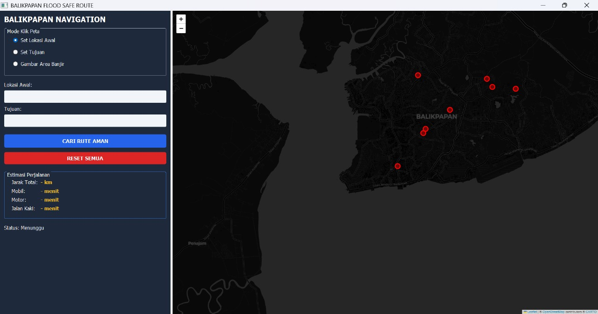
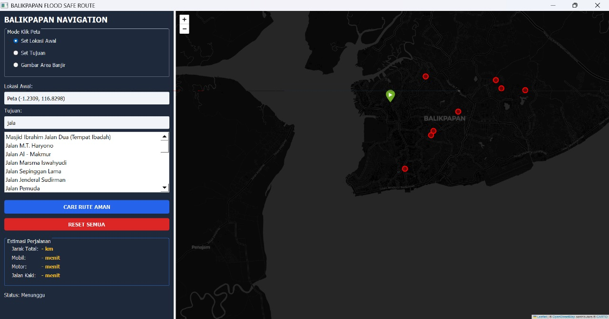
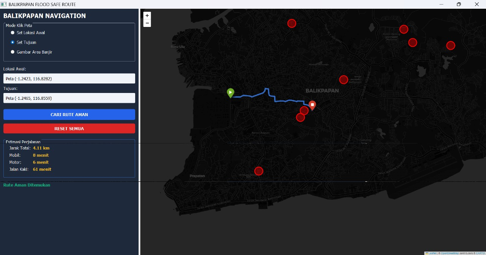
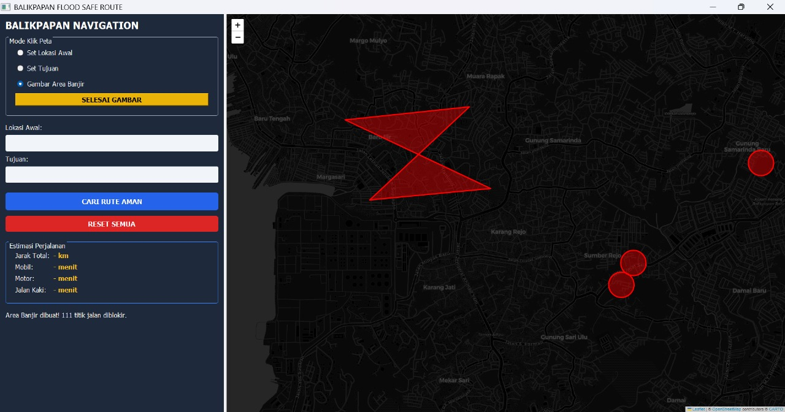
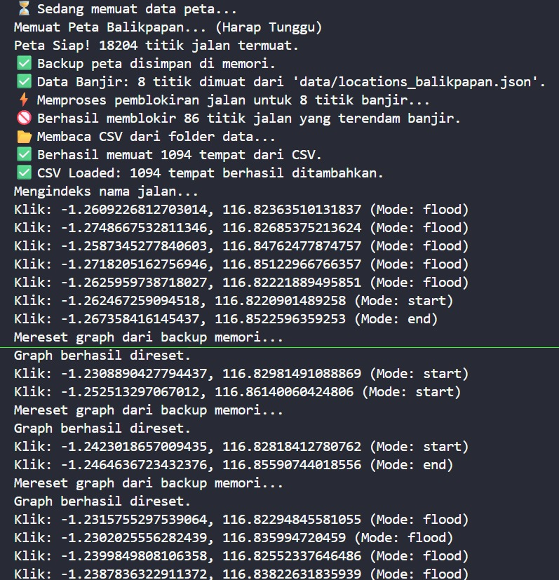

**REKOMENDASI RUTE AMAN SAAT BANJIR DI KOTA BALIKPAPAN MENGGUNAKAN ALGORITMA PATHFINDING DIJKSTRA**

---

**Pengantar Kecerdasan Artifisial B**  
**Kelompok 2**

| NAMA | NIM |
| :---- | :---- |
| Amalia Rahmanda | 11241012 |
| Daniel Juan Haris Hutajulu | 11241024 |
| Muhammad Rizky Wicaksono | 11241062 |
| Nabil Arif Ikhwanul Hakim | 11241066 |

---

1. **Abstrak**

Banjir merupakan peristiwa yang sering terjadi di Kota Balikpapan, terutama pada musim penghujan, dan mengakibatkan terganggunya aktivitas masyarakat termasuk mobilitas di jalan raya. Permasalahan yang muncul adalah ketidaktahuan pengendara terhadap kondisi ruas jalan yang tergenang serta kesulitan dalam menemukan rute alternatif yang aman dan masih dapat dilalui saat banjir. Penelitian ini bertujuan untuk memberikan rekomendasi rute aman saat banjir dengan memanfaatkan Algoritma Dijkstra sebagai metode utama. Penelitian akan dilengkapi dengan identifikasi titik-titik rawan banjir dan pemetaan jaringan jalan yang masih layak dilalui, sehingga dapat menghasilkan rute yang tidak hanya terpendek tetapi juga mempertimbangkan faktor keamanan dari genangan. Digambarkan pula penerapan Algoritma Dijkstra dalam konteks penentuan rute aman ini. Hasil yang diperoleh dari penelitian ini adalah beberapa rekomendasi rute optimal yang menghubungkan lokasi-lokasi vital di Kota Balikpapan, dengan titik awal simulasi dari Bandara Sultan Aji Muhammad Sulaiman Sepinggan.  
   
Kata Kunci: Banjir, Rute Aman, Algoritma Dijkstra, Balikpapan, Rekomendasi Jalan.

***Abstract***

*Flooding is a frequent event in Balikpapan City, especially during the rainy season, disrupting community activities including road mobility. The main problems are drivers' lack of information about flooded road sections and the difficulty in finding safe alternative routes that are still passable during floods. This study aims to provide recommendations for safe routes during floods by utilizing Dijkstra's Algorithm as the primary method. The research will be supplemented by identifying flood-prone points and mapping the still-passable road network, to produce routes that are not only the shortest but also consider safety factors from inundation. The application of Dijkstra's Algorithm in the context of determining safe routes is also described. The results obtained from this study are several optimal route recommendations connecting vital locations in Balikpapan City, with the simulation starting point from Sultan Aji Muhammad Sulaiman Sepinggan Airport.*  
   
*Keywords: Flood, Safe Route, Dijkstra's Algorithm, Balikpapan, Route Recommendation.*

2. **PENDAHULUAN**

Banjir merupakan bencana hidrometeorologis yang kerap melanda Kota Balikpapan, terutama pada periode musim penghujan dengan intensitas tinggi, dimana fenomena ini telah menjadi ancaman tahunan yang signifikan terhadap tatanan kehidupan perkotaan. Secara geografis, kondisi topografi yang bervariasi dan alih fungsi tutupan lahan di beberapa wilayah kota, seperti daerah dataran rendah dan sekitar aliran sungai. Secara nyata berkontribusi terhadap pembentukan genangan yang luas dan dalam, sehingga secara sistematis mengakibatkan terputusnya akses transportasi utama dan sekunder. Juga, dapat menimbulkan kerugian ekonomi yang tidak sedikit bagi sektor perdagangan dan jasa, serta pada tingkat yang lebih kritis membahayakan keselamatan jiwa penduduk.  
Bagi masyarakat luas, termasuk para pengendara harian yang harus beraktivitas, seperti petugas layanan darurat yang dituntut respons cepat, dan wisatawan yang belum familiar dengan medan, mobilitas yang terhambat ini menjadi masalah krusial yang memerlukan solusi segera. Mengingat sistem navigasi digital yang umum digunakan saat ini, seperti berbagai aplikasi peta konvensional, dalam operasionalnya seringkali hanya mengoptimalkan penentuan rute berdasarkan satu parameter utama, yaitu jarak terpendek secara geografis atau estimasi waktu tempuh tercepat dalam kondisi normal, tanpa memiliki kemampuan untuk mempertimbangkan parameter keselamatan jalan yang dinamis dan kritis. Contohnya seperti, variasi ketinggian genangan, tingkat bahaya arus air, ataupun kelayakan suatu lintasan untuk dilalui kendaraan ringan saat banjir. Sehingga, pada praktiknya mengakibatkan pengguna yang percaya pada rekomendasi sistem tersebut berisiko tinggi terjebak di jalur yang terendam di luar kemampuan kendaraan mengalami kerusakan kendaraan atau terpaksa melakukan pemutaran yang sangat jauh sehingga menghabiskan waktu dan sumber daya.  
Penelitian terkait penentuan rute terpendek sudah banyak dilakukan dengan berbagai Algoritma, meliputi algoritma A\*, floyd, dynamic programming, dan juga dijkstra. Khusus pada penelitian ini akan menggunakan Algoritma Dijkstra. Algoritma Dijkstra merupakan salah satu algoritma yang sangat populer dari teori graf untuk menentukan jalur terpendek. Algoritma Dijkstra mencari jalur terpendek dengan membandingkan bobot terkecil dari node awal sampai node terakhir atau tujuan, untuk menemukan jalur paling efektif dan efisien yang terhindar dari banjir untuk ditempuh. Pada tahun 1950, menentukan jalur terpendek merupakan masalah yang telah banyak dibahas dan dipelajari. Pencarian jalur terpendek ini telah diterapkan di berbagai bidang untuk mengoptimalkan kinerja transmisi otomatis. Salah satu pencarian jalur terpendek yang paling menarik untuk dibahas adalah terkait transportasi. Algoritma Dijkstra dipilih untuk penentuan rute aman dan pendek saat banjir karena algoritma ini dapat menentukan rute optimal dari graf berbobot dengan nilai bobot bernilai lebih besar dari nol (positif), mulai dari titik awal menuju semua titik tujuan yang diinginkan. Dengan demikian, dapat ditemukan rute yang paling optimal dari titik awal hingga mencapai titik akhir dengan mempertimbangkan faktor risiko banjir. Tujuannya adalah untuk menentukan representasi graf berarah yang mencakup seluruh rute jalan di Kota Balikpapan, sekaligus menetapkan rute yang paling aman dan efisien dari titik awal yang ditetapkan menuju berbagai lokasi vital dan zona aman di Kota Balikpapan menggunakan Algoritma Dijkstra.  
Oleh karena itu, diperlukan sebuah sistem rekomendasi rute yang bersifat spesifik dan adaptif, yang tidak hanya mengejar efisiensi dalam arti sempit tetapi juga mengutamakan aspek keamanan sebagai prinsip utama. Dengan cara mengintegrasikan data kondisi jalan secara real time atau historis saat bencana banjir ke dalam logika perhitungan pencarian jalur optimal. Selanjutnya, mengembangkan sebuah model rekomendasi rute perjalanan darat yang andal dan aman selama kondisi banjir berlangsung di Kota Balikpapan dengan menerapkan Algoritma Dijkstra sebagai metode inti dan teruji untuk mencari jalur dengan biaya kumulatif terendah di dalam sebuah graf yang dimodelkan dari peta jalan, dimana definisi biaya pada penelitian ini secara inovatif tidak hanya direduksi sebagai representasi jarak fisik antar simpul, tetapi juga diperkaya dengan faktor pembobotan tambahan yang merepresentasikan tingkat keamanan dari genangan dan kerawanan suatu ruas jalan. Serta bertujuan untuk membuat simulasi perhitungan dan memetakan beberapa skenario rute aman dari titik awal strategis yang ditetapkan.

**C. DATA USED**  
**Total Banjir dan Nama Tempat**

| Permukiman | Jalan Besar | Titik lain |
| :---- | :---- | :---- |
| Perum Sosial, Kelurahan Sepinggan Perum Sosial RT 28, Kelurahan Batu Ampar Jalan Sepinggan Baru PT HER 1 BDS 2 Permukiman Beller Kelurahan Damai Gang Mufakat I, Kelurahan Damai Bahagia Sumber Rejo, Balikpapan Tengah | Jalan MT Haryono Jalan Beller Simpang Gunung Sari  Gunung Malang Jalan Sumber Rejo Jalan Batakan Jalan BJBJ Jalan Manggar, area Batakan Jalan Penggalang, Damai  | Depan Stadion Batakan Jalan Ahmad Yani Sekitar RS Ibnu Sina Muara Rapak  |

**Bukti:**

- [https://kaltimpost.jawapos.com/balikpapan/2386892917/balikpapan-banjir-lagi-jalan-mt-haryono-dan-simpang-grand-city-terendam-air?utm\_source](https://kaltimpost.jawapos.com/balikpapan/2386892917/balikpapan-banjir-lagi-jalan-mt-haryono-dan-simpang-grand-city-terendam-air?utm_source)  
- [https://kaltim.herald.id/2025/06/19/data-banjir-di-balikpapan-7-titik-permukiman-24-titik-jalan-utama-3-longsor-dan-pohon-tumbang/?utm\_source](https://kaltim.herald.id/2025/06/19/data-banjir-di-balikpapan-7-titik-permukiman-24-titik-jalan-utama-3-longsor-dan-pohon-tumbang/?utm_source)

**D. METODE PENELITIAN**

1. **Objective Function**  
   	Sistem navigasi rute banjir ini bertujuan untuk meminimalkan total biaya perjalanan (Total Travel Cost) dari titik awal (Start) ke titik tujuan (End), dengan kendala utama berupa penghindaran area banjir.  
   Rumus pencarian rute  
    \[
    Z = \sum _ { i = 1 } ^ { n - 1 } w ( v _ { i } , v _ { i + 1 } )
    \]

   Keterangan Simbol :
* Z : Total Biaya (Total Cost) atau total jarak tempuh rute akhir dalam satuan meter.  
* n : Jumlah total simpul (nodes) yang dilalui dalam rute tersebut.  
* i : Indeks urutan simpul (dari simpul ke-1, ke-2, dst).  
* w : *Weight* (Bobot), yaitu jarak fisik antara simpul saat ini (v1) dengan simpul berikutnya vi+1  
* v: *Vertex* atau Node (titik persimpangan jalan).  
  Rumus ini menyatakan bahwa jarak total adalah hasil penjumlahan panjang jalan dari satu persimpangan ke persimpangan berikutnya sepanjang rute.  
  Rumus Deteksi Area Banjir (Constraint) Sistem menggunakan *Euclidean Distance* untuk mengukur jarak antara titik jalan dengan pusat banjir.

  d \= (x2-x1)2+(y2-y1)2

  Keterangan Simbol:  
* d : Jarak (Distance) antara titik jalan dan pusat banjir.  
* x1,y1 : Koordinat Latitude dan Longitude dari simpul jalan.  
* x2,y2 : Koordinat Latitude dan Longitude dari pusat data banjir.  

  **Logika Pemblokiran (Geofencing)** Setelah jarak (d) diketahui, sistem menerapkan logika pertidaksamaan terhadap Radius Aman (Rsafe) sebesar 150 meter:  
  kondisi aman  
  d \> Rsafe : node aman (valid)  
  kondisi banjir  
  d Rsafe    : node dihapus (Simpul jalan dianggap biaya tak terhingga dan dihapus dari graf)  
  Status Node \= Valid jika jarak \> Radius, dan Invalid jika jarak \<= Radius).  
  Tujuan Algoritma: Algoritma Dijkstra akan mencari kombinasi simpul jalan sedemikian rupa sehingga nilai Z adalah yang paling minimum (terkecil), namun dengan syarat tidak ada satupun simpul yang berstatus Invalid (banjir).  
2. **Deterministic Geofenced Pathfinding**  
   Metode pencarian jalur menggunakan pendekatan Deterministic Graph Search yang bertujuan untuk menjamin keamanan navigasi di lingkungan yang memiliki kendala spasial (spatial constraints). Sistem ini bekerja dengan memodifikasi struktur graf dasar (Base Graph) melalui teknik Node Pruning (pemangkasan simpul), di mana simpul jalan yang terdeteksi berada dalam radius bahaya akan dieliminasi dari memori sebelum perhitungan rute dilakukan.  
   Peningkatan keamanan terjadi karena algoritma tidak hanya berfokus pada minimalisasi jarak (cost minimization), tetapi melakukan Geometric Filtering terhadap integritas jalur. Setiap simpul jalan dievaluasi posisinya terhadap titik pusat banjir menggunakan perhitungan Euclidean Distance. Hal ini memastikan bahwa algoritma pencari rute (Dijkstra) tidak akan pernah "melihat" jalan yang banjir sebagai opsi yang valid, sehingga risiko terjebak genangan air dapat direduksi hingga 0%.  
   Pada tahap eksekusi, sistem menggunakan struktur data Priority Queue untuk mengeksplorasi jaringan jalan OSMnx secara efisien. Berbeda dengan sistem navigasi konvensional yang hanya mementingkan kecepatan waktu tempuh, fokus utama sistem ini adalah pada "Safety-First Routing", yaitu bagaimana sistem mampu melakukan rerouting (pencarian jalur alternatif) secara otomatis ketika jalur utama terputus oleh intervensi data banjir, tanpa memerlukan input manual berulang dari pengguna.  
     
3. **Spatial Knowledge Representation**  
   Berbeda dengan sistem berbasis machine learning yang membangun pengetahuan melalui iterasi training, sistem navigasi ini menggunakan pendekatan Static Knowledge Base yang dibangun pada tahap inisialisasi (pre-computation phase). Pengetahuan sistem terbagi menjadi dua lapisan data utama yang digabungkan menjadi satu kesatuan graf navigasi.

   **a) Topological Knowledge (Jaringan Jalan)**   
   Pengetahuan dasar sistem mengenai konektivitas kota diambil dari OpenStreetMap melalui modul OSMnx. Data ini merepresentasikan "Dunia Fisik" yang terdiri dari:  
* Nodes (Simpul): Persimpangan jalan atau titik ujung jalan.  
* Edges (Sisi): Ruas jalan yang memiliki atribut bobot seperti panjang (length) dan arah (oneway). Sistem menyimpan ini dalam struktur data MultiDiGraph (Directed Multi-Graph) menggunakan library NetworkX. 

  **b) Hazard Knowledge (Data Banjir)** Lapisan pengetahuan kedua adalah "Zona Bahaya" yang bersumber dari data eksternal (locations\_balikpapan.json). Data ini bertindak sebagai Constraint Layer (Lapisan Kendala). Sistem tidak memprediksi banjir, melainkan "mengetahui" lokasi banjir secara deterministik dan mengubah struktur topologi graf dengan menghapus simpul-simpul yang bertentangan dengan data bahaya ini (radius 150m).  
   	Dengan menggabungkan Topological Knowledge dan Hazard Knowledge, sistem membentuk "Safe-Graph" baru. Jadi, ketika algoritma pencari rute dijalankan, ia tidak perlu lagi melakukan pengecekan berulang kali ("apakah ini banjir?"), karena graf yang ia jelajahi sudah dipastikan bersih dari simpul berbahaya sejak awal.  
    
    
    
4. **Tahap Penelitian**  
   Penelitian ini menggunakan Algoritma Dijkstra dengan Flood-Aware Optimization. Metode ini menerapkan pendekatan search algorithm dalam kecerdasan buatan tradisional yang bertujuan untuk menemukan rute optimal dengan mempertimbangkan kendala banjir. Algoritma Dijkstra dimodifikasi untuk menjadi flood-aware, di mana sistem tidak hanya mencari jarak terpendek tetapi juga menghindari area yang terdampak banjir.  
   Prinsip kerja algoritma ini adalah dengan melakukan look-ahead evaluation terhadap semua kemungkinan rute, kemudian memilih path dengan minimum cost berdasarkan fungsi objektif yang mempertimbangkan baik jarak fisik maupun risiko banjir. Setiap aksi (perpindahan dari satu node ke node lain) dihitung nilainya berdasarkan objective function, dan aksi dengan nilai minimum tersebut akan dieksekusi.  
   Peningkatan kualitas keputusan terjadi karena algoritma tidak hanya melihat kondisi lokal saat ini, tetapi juga mempertimbangkan dampak kumulatif dari setiap keputusan terhadap keseluruhan perjalanan, terutama dalam menghadapi kondisi dinamis zona banjir yang dapat berubah-ubah berdasarkan data real-time.  
     
5. **Algoritma Dijkstra**  
   Algoritma Dijkstra dijkstra ditemukan oleh Edsger Wybe Dijkstra pada tahun 1959\. Algoritma ini merupakan algoritma yang dapat memecahkan masalah pencarian jalur terpendek dari suatu graf pada setiap simpul yang bernilai tidak negatif. Dijkstra merupakan algoritma yang termasuk dalam algoritma greedy, yaitu algoritma yang sering digunakan untuk memecahkan masalah yang berhubungan dengan suatu optimasi. Dalam pencarian jalur terpendeknya algoritma dijkstra bekerja dengan mencari bobot yang paling minimal dari suatu graf berbobot, jarak terpendek akan diperoleh dari dua atau lebih titik dari suatu graf dan nilai total yang didapat adalah yang bernilai paling kecil.  
   Langkah-langkah dalam algoritma Dijkstra adalah sebagai berikut:  
1. Inisialisasi: Mulai dengan simpul awal, atur jaraknya menjadi nol dan berikan jarak tak terhingga (atau sangat besar) ke semua simpul lain sebagai jarak awal. Tentukan juga simpul awal sebagai simpul aktif saat ini.  
2. Pemilihan Simpul Aktif: Tentukan simpul dengan jarak terpendek dari simpul awal sebagai simpul aktif. Ini adalah simpul yang pada langkah awal memiliki jarak nol.  
3. Pembaruan Jarak: Evaluasi semua simpul tetangga dari simpul aktif dan cek apakah jarak melalui simpul aktif ini lebih pendek dibandingkan jarak saat ini ke tetangga tersebut. Jika benar, perbarui jarak tetangga dengan jarak yang lebih pendek.   
4. Penandaan Simpul Aktif: Setelah memperbarui jarak ke semua tetangga, tandai simpul aktif sebagai "telah dikunjungi" atau "selesai".  
5. Pemilihan Simpul Baru: Pilih simpul dengan jarak terpendek yang belum dikunjungi sebagai simpul aktif berikutnya. Ini adalah simpul dengan jarak terpendek di antara semua simpul yang belum dikunjungi.  
6. Pengulangan: Ulangi langkah 3 hingga 5 sampai semua simpul telah dikunjungi atau simpul tujuan tercapai.  
7. Hasil: Setelah semua simpul telah dikunjungi atau simpul tujuan dicapai, hasil yang diperoleh adalah jarak terpendek dari simpul awal ke simpul tujuan.  

   

   

**E. IMPLEMENTASI**

1. **Environment Setup**   
   Pada sistem navigasi yang telah kami buat, kami menggunakan library PyQt5 untuk membangun antarmuka pengguna (GUI) berbasis desktop dan Folium untuk visualisasi peta interaktif. Data jaringan jalan diambil secara real time dari OpenStreetMap menggunakan library OSMnx dan dikelola strukturnya menggunakan NetworkX. Untuk data lokasi banjir dan tempat penting, kami menggunakan sistem manajemen file berbasis JSON dan CSV yang diletakkan di dalam folder data/, sehingga data dapat diperbarui dengan mudah tanpa mengubah kode program utama. Pengaturan konstanta fisika seperti konversi koordinat ke meter dan radius bahaya banjir diletakkan secara terpusat pada modul core/graph.py

2. **Data Modeling**   
1. Flood Data Model (locations\_balikpapan.json) Data banjir disimpan dalam format JSON array yang memuat informasi koordinat dan metadata lokasi. Sistem kami dilengkapi filter cerdas untuk menangani data yang tidak lengkap (null).  
   {  
     "locations": \[  
       {  
         "name": String,       // Nama lokasi/jalan (Contoh: "Jalan MT Haryono")  
         "latitude": Float,    // Koordinat Lintang (Bisa null jika data tidak ada)  
         "longitude": Float,   // Koordinat Bujur (Bisa null jika data tidak ada)  
         "note": String        // Catatan tambahan mengenai sumber data  
       }  
     \]  
   }  
     
2. Place Data Model (tempat\_balikpapan.csv)   
   Data lokasi tujuan pencarian disimpan dalam format CSV sederhana untuk memudahkan penambahan data manual.  
   Cuplikan kode  
   Nama Tempat, Latitude, Longitude  
     
3. Environment Settings Konstanta yang digunakan dalam perhitungan logika spasial:  
   METERS\_PER\_DEGREE \= 111320        \# Konversi selisih derajat ke meter di Ekuator  
   DEFAULT\_FLOOD\_RADIUS \= 150        \# Radius aman area banjir (meter)  
   MAP\_CENTER \= \[-1.265, 116.831\]   \# Titik tengah peta Balikpapan  
   ZOOM START \= 13  
   

### **3\. Algorithm Integration**

### Sistem navigasi ini menggunakan pendekatan Geofence Pathfinding, di mana peta dimodifikasi terlebih dahulu sebelum rute dihitung.

1. Graph Initialization & Geofencing (Pencegahan) Saat aplikasi dimulai, sistem memuat graf jalan raya dari OpenStreetMap. Kemudian, algoritma Euclidean Distance dijalankan untuk mendeteksi simpul jalan (*nodes*) yang berada di dalam radius bahaya banjir. Simpul yang terdampak akan dihapus (*removed*) dari graf secara otomatis. Tujuannya: Memastikan algoritma pencari rute tidak akan pernah mempertimbangkan jalan yang banjir sebagai opsi yang valid.  
2. Route Calculation (Dijkstra Algorithm) Setelah graf bersih dari titik banjir, sistem menggunakan algoritma Dijkstra dengan struktur data *Priority Queue* (Heapq). Algoritma ini menjamin ditemukannya rute terpendek berdasarkan bobot panjang jalan (*length*) dari titik Start ke Finish.  
3. Geometry Smoothing Berbeda dengan penarikan garis lurus, sistem kami memanfaatkan atribut geometry dari data OSMnx. Hasil rute bukan hanya sekadar garis lurus antar-simpang, melainkan mengikuti lekukan aspal (*curved path*) agar visualisasi pada peta terlihat realistis dan akurat.  
4. User Interaction (Dynamic Inputs) Sistem mendukung input dinamis di mana pengguna dapat :  
1. Mengetik nama lokasi (Auto-complete).  
2. Mengklik langsung pada peta (Coordinate capture).  
3. Menggambar area banjir baru secara manual (Polygon Flood) yang akan langsung memicu perhitungan ulang pada Graph.

**4\. Simulation Engine & Code Structure**

1. **Folder Structure**   
   root/  
       data/                 	\# Penyimpanan dataset JSON & CSV  
       core/                 	\# Logika Utama (Back-end)  
           graph.py          	\# Manajemen peta & pemblokiran jalan  
           dijkstra.py       	\# Algoritma pencarian rute  
       ui/                   	\# Tampilan (Front-end)  
           main\_window.py 	    \# Kontrol menu & input user  
           map\_widget.py    	\# Integrasi Folium & PyQt  
       main.py               	\# Entry point aplikasi  
     
2. **Implementation Flow** 

1\) Main Graph Logic (core/graph.py)   
Bagian ini menangani pembuatan peta dan logika pemblokiran jalan. Fungsi apply\_flood\_data bertugas menghitung jarak tiap titik jalan ke pusat banjir.

def apply\_flood\_data(self, flood\_points):

    \# Iterasi seluruh node jalan di Balikpapan  
        for node, data in self.G.nodes(data=True):  
        \# Hitung jarak node ke pusat banjir (dalam meter)  
        dist\_meters \= calculate\_distance(node, flood\_center)  
          
        \# Jika masuk radius bahaya, tandai untuk dihapus  
        if dist\_meters \<= radius:  
            nodes\_to\_remove.append(node)  
              
    \# Hapus node dari memori Graph  
    self.G.remove\_nodes\_from(nodes\_to\_remove)

2\) Pathfinding Core (core/dijkstra.py)   
Algoritma pencarian rute dijalankan saat tombol "Cari Rute" ditekan. Fungsi ini bekerja di atas graf yang sudah dimodifikasi (bebas banjir). 

def find\_route(self, start\_lat, start\_lon, end\_lat, end\_lon):  

    \# Cari node jalan terdekat dari koordinat input user  
    start\_node \= self.get\_nearest\_node(start\_lat, start\_lon)  
    end\_node \= self.get\_nearest\_node(end\_lat, end\_lon)

    \# Jalankan Dijkstra (Priority Queue)  
    queue \= \[(0, start\_node)\]  
    distances \= {start\_node: 0}  
      
    while queue:  
        current\_dist, current\_node \= heapq.heappop(queue)  
          
        if current\_node \== end\_node:  
            break \# Tujuan ditemukan

        \# Evaluasi tetangga (neighbor nodes)  
        for neighbor, weight in self.graph\[current\_node\]:  
            new\_dist \= current\_dist \+ weight  
            if new\_dist \< distances\[neighbor\]:  
                distances\[neighbor\] \= new\_dist  
                previous\_nodes\[neighbor\] \= current\_node  
                heapq.heappush(queue, (new\_dist, neighbor))  
                  
    \# Rekonstruksi jalur & Ambil detail geometri jalan  
    return self.reconstruct\_path\_with\_geometry(previous\_nodes, end\_node)

3\) Visualization Logic (ui/map\_widget.py)   
Menangani komunikasi antara Python dan JavaScript (Leaflet/Folium) untuk menampilkan marker, garis rute, dan area banjir polygon.

def add\_flood\_polygon(self, points):

    \# Menggambar area merah (Danger Zone) di peta  
    folium.Polygon(  
        locations=points,  
        color="red",  
        fill=True,  
        fill\_opacity=0.4  
    ).add\_to(self.map\_obj)  
def add\_flood\_polygon(self, points):
  
    \# Menggambar area merah (Danger Zone) di peta  
    folium.Polygon(  
        locations=points,  
        color="red",  
        fill=True,  
        fill\_opacity=0.4  
    ).add\_to(self.map\_obj)

**F. DEMO APPLICATION**

  
**Gambar 1.1**  
Ini adalah tampilan awal dari program ketika dijalankan, dan langsung tertampil area yang sedang banjir (circle redzone) berdasarkan data location\_balikpapan.json.

  
**Gambar 1.2**  
Ini adalah tampilan jika user ingin input lokasi, bisa dengan input manual lokasi yang diinginkan (akan memunculkan nama rekomendasi tempat) dan bisa klik pada map langsung. Jika user sudah input lokasi awal, akan muncul marker hijau sebagai penanda lokasi awal.

  
**Gambar 1.3**  
Ini untuk set tujuan user, bisa dengan mencari di input field maupun klik langsung pada map.

  
**Gambar 1.4**  
Ketika semua input bar sudah dilakukan termasuk marker hijau sebagai set lokasi awal dan marker merah kotak putih sebagai penanda set tujuan, klik “cari rute aman” dan akan memunculkan navigasi biru serta juga muncul informasi terkait perjalanan di kotak kiri sebelah map.

  
**Gambar 1.5**  
Dan ketika user ingin reset, tinggal klik tombol “reset semua” dan akan otomatis menghilangkan seluruh input user dari awal.

  
**Gambar 1.6**  
Dan user bisa menambah daerah banjir manual di bagian tombol “Gambar Area Banjir” sebagai antisipasi banjir jika tidak terdeteksi di aplikasi (tidak ada di dataset) sehingga dengan input mandiri, aplikasi tetap bisa bekerja menghindari banjir walau dari input user daerah banjir tadi.

---

**G. HASIL**

  
**Gambar 2.1**  
ini adalah output terminal Ketika aplikasi di run dan mencatat seluruh aktivitas yang dilakukan pada aplikasi.
 
---

**ILUSTRASI**  
[https://github.com/Daburbf/Balikpapan\_Flood\_Route.git](https://github.com/Daburbf/Balikpapan_Flood_Route.git)

---

**REFERENSI** 

**Kade Puja Arimbawa K. I. B.** (2024). Algoritma Dijkstra : Rute Pengungsian Terpendek Daerah Rawan Bencana di Desa Canggu. [DOI: 10.24843/JMAT.2024.v14.i01.p171](https://ojs.unud.ac.id/index.php/jmat/article/view/114885)

**Bunaen M. C., Pratiwi H., Riti Y.F.** (2022). PENERAPAN ALGORITMA DIJKSTRA UNTUK MENENTUKAN RUTE TERPENDEK DARI PUSAT KOTA SURABAYA KE TEMPAT BERSEJARAH. [DOI : https://doi.org/10.47233/jteksis.v4i1.407](https://doi.org/10.47233/jteksis.v4i1.407)

**Dijkstra, E. W. (1959)**. A note on two problems in connexion with graphs. Numerische Mathematik, 1(1), 269–271. [https://doi.org/10.1007/BF01386390](https://doi.org/10.1007/BF01386390)